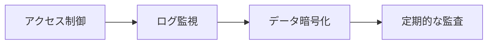

# 🏗️ Context7 運用ガイドライン

## 📅 定期メンテナンス
<div style="background-color: #E8F5E9; padding: 10px; border-left: 4px solid #4CAF50;">
✅ <strong>推奨スケジュール</strong>:
- 毎日: ログ確認
- 毎週: リソース使用量チェック
- 毎月: バージョンアップデート確認
</div>

## 🔐 セキュリティポリシー


## 🚨 インシデント対応
| レベル | 対応時間 | 対応内容 |
|--------|----------|----------|
| <span style="color: #F44336;">緊急</span> | 1時間以内 | システム停止対応 |
| <span style="color: #FF9800;">高</span> | 24時間以内 | 主要機能障害対応 |
| <span style="color: #2196F3;">中</span> | 3営業日以内 | 軽微な不具合対応 |

## 📊 パフォーマンスチューニング
```javascript
// 推奨設定
const config = {
  maxConnections: 10,
  timeout: 30000,
  retryPolicy: {
    maxRetries: 3,
    delay: 1000
  }
};
```

<div style="color: #795548; border: 1px solid #795548; padding: 10px; border-radius: 5px;">
ℹ️ <strong>運用ノート</strong>: 月次レポート作成時に全てのログを確認してください
</div>