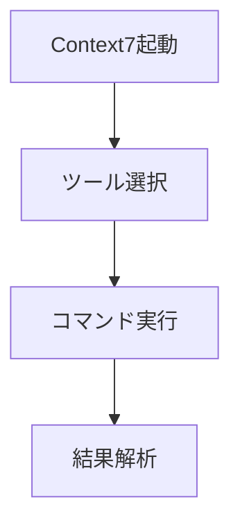

# 📘 Context7 使い方マニュアル

<div style="color: #4CAF50; font-weight: bold;">🟢 最新バージョン: 1.0.0</div>

## 🚀 基本機能


## 🔧 セットアップ手順
1. <span style="color: #2196F3;">📦 パッケージインストール</span>
   ```bash
   npm install @upstash/context7-mcp
   ```

2. <span style="color: #FF9800;">⚙️ 設定ファイル作成</span>
   ```javascript
   // mcp-config.json
   {
     "server": "context7-mcp",
     "version": "1.0.0"
   }
   ```

## 🎯 主要コマンド
| コマンド | 説明 | 例 |
|---------|------|----|
| `list-tools` | 利用可能ツール一覧 | `mcp.sendCommand('list-tools')` |
| `analyze` | データ分析 | `mcp.sendCommand('analyze data')` |

<div style="background-color: #FFF3E0; padding: 10px; border-left: 4px solid #FFA726;">
⚠️ <strong>注意事項</strong>: コマンド実行後は必ず結果を確認してください
</div>