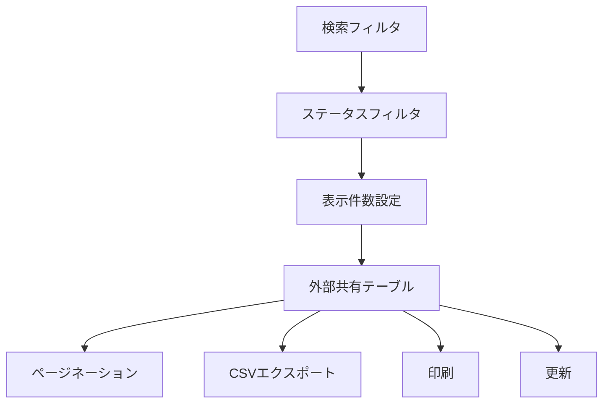
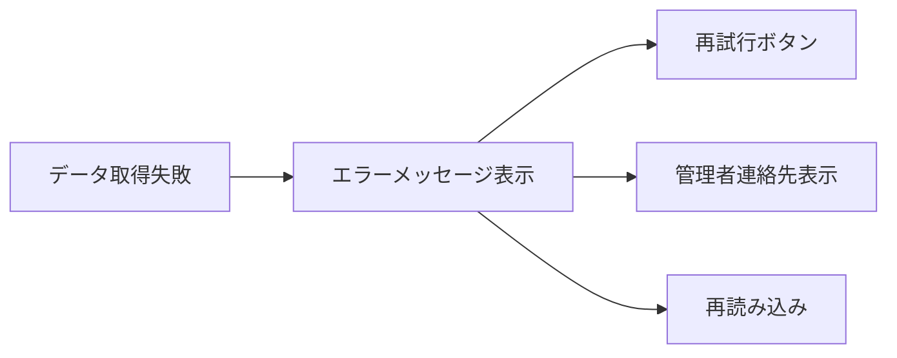

# 🌐 ExternalShareCheck.html 仕様書

## 🌟 概要
外部共有レポートを表示・管理するWebインターフェース

## 🛠️ 主な機能
- 外部共有データの一覧表示
- リスクレベル評価（即時対応/確認推奨/問題なし）
- 詳細なフィルタリング機能
- CSVエクスポート機能
- 印刷機能
- データ更新機能

## 🎨 UI構成

## 📊 テーブル構成
| カラム | 説明 | スタイル |
|--------|------|--------|
| 所有者 | ユーザー名 | 青グラデーション |
| 共有アイテム | ファイル名 | 黄グラデーション |
| 外部共有先 | ドメイン | 赤グラデーション |
| 共有日 | 日付 | 水色グラデーション |
| 推奨アクション | リスク評価 | 状態別色分け |

## 🔍 フィルタ機能
1. **グローバル検索**:
   - 全カラム横断検索
2. **ステータスフィルタ**:
   - すべてのステータス
   - 問題なし
   - 即時対応
   - 確認推奨
3. **表示件数設定**:
   - 10/25/50/100件/全件

## 📑 ページネーション
- ページ送り機能
- 現在表示中の件数表示
- 総件数表示

## 🚨 エラーハンドリング

## 💻 使用技術
- Bootstrap 5.3.0
- Font Awesome 6.4.0
- カスタムCSS (グラデーション)
- JavaScript (動的フィルタリング)

## 🔐 認証要件
1. **CSVから生成**:
   - 認証不要
   - 既存CSVデータ使用
2. **Graph APIから取得**:
   - Azure AD認証が必要
   - 必要な権限:
     - Files.Read.All
     - Sites.Read.All
     - User.Read.All

## 🎯 特徴
- リスクレベルに基づく色分け
- ホバーエフェクト
- レスポンシブデザイン
- ローディングインジケータ

## ⚠️ 注意点
- 外部共有は高リスク判定
- 機密ファイルは即時対応が必要
- データ更新に最大2分
- 大量データはページネーション推奨

## 📅 更新情報
- **最終更新日**: 2025年4月28日
- **現在の動作状況**:
  - WebUIサーバー: ポート8005で稼働中 (http://localhost:8005/ExternalShareCheck.html)
  - テストデータ: シミュレーションデータを使用中
