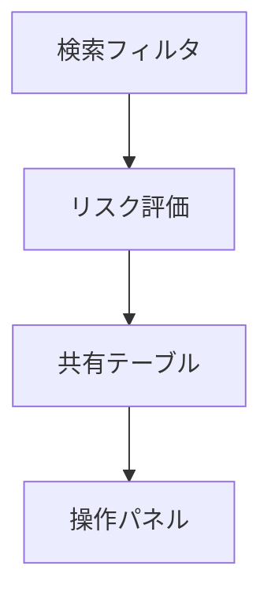

# 🌐 ExternalShareCheck.html 仕様書

## 🌟 概要
外部共有ファイルを監査する管理画面

## 🛠️ 主な機能
- 外部共有ファイル一覧
- 共有先ドメイン別分類
- リスクレベル評価
- CSVエクスポート
- 印刷レポート生成

## 🎨 UI構成

## 💻 使用技術
- Bootstrap 5 (レイアウト/コンポーネント)
- Font Awesome (アイコン)
- カスタムCSS (ドメイン別色分け)

## 🔐 認証要件
- この画面はExternalShareCheck.ps1で生成され、以下の2つのモードがあります:

1. **CSVから生成する場合**:
   - 認証不要
   - 既存のCSVデータを使用

2. **Graph APIから直接取得する場合**:
   - Azure ADアプリ登録が必要:
     - テナント管理者によるアプリ登録
     - 必要なAPI権限の付与
     - 管理者の同意が必要
   - config.json設定:
     - TenantId: Azure ADテナントID
     - ClientId: 登録アプリのクライアントID
     - ClientSecret: クライアントシークレット
     - 非対話型認証(client_credentials grant)を使用
   - 必要なGraph API権限:
     - Files.Read.All
     - Sites.Read.All
     - User.Read.All

## 🚨 注意点
- 外部ドメイン共有は自動で高リスク判定
- 機密ファイルの共有は即時対応が必要
- データ更新には時間がかかる場合あり

## 🎯 特徴
- ドメイン信頼度に基づく色分け(自社:緑/提携先:青/不明:黄/危険:赤)
- 詳細な共有権限表示
- レスポンシブデザイン対応
