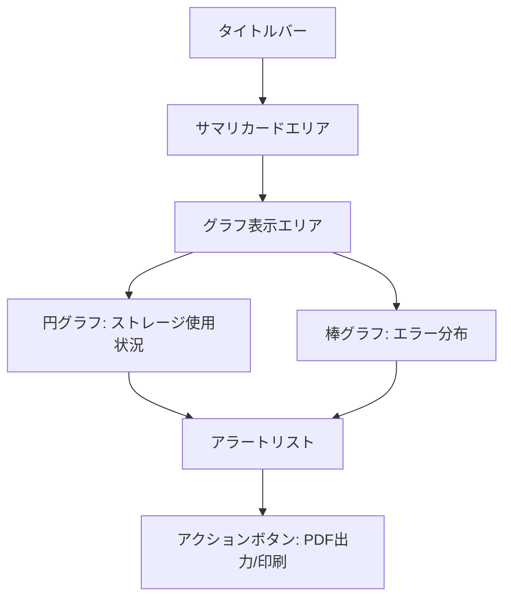

# 📊 GenerateReport.html 仕様書

## 🌟 概要
OneDrive管理の総合レポートを表示するダッシュボード画面

## 🛠️ 主な機能
- ユーザー統計のサマリ表示（総ユーザー数、同期エラー、外部共有、正常ユーザー）
- ストレージ使用状況の円グラフ表示（SVG実装）
- エラー分布の棒グラフ表示（SVG実装）
- 直近アラート一覧表示
- PDFレポート出力機能（Graph API連携）
- 印刷機能

## 🎨 UI構成


## 💻 使用技術
- Bootstrap 5 (レイアウト)
- Font Awesome (アイコン)
- SVG (グラフ表示)
- Fetch API (Graph API連携)
- Microsoft Graph API (データ取得)

## 🔐 認証要件
- Graph APIを使用する場合、以下の設定が必要:
  - Azure ADアプリ登録
  - 必要なAPI権限:
    - Reports.Read.All
    - User.Read.All
  - config.json設定:
    - TenantId: Azure ADテナントID
    - ClientId: アプリケーションID
    - ClientSecret: クライアントシークレット

## 🚨 エラーハンドリング
1. **Graph API接続エラー**:
   - エラーメッセージを表示
   - ローディング表示を非表示
   - コンソールにエラー詳細を出力

2. **部分データ取得エラー**:
   - 取得できたデータのみ表示
   - エラーが発生したセクションには警告表示

3. **描画エラー**:
   - SVGグラフの代替テキスト表示
   - エリアの背景色を変更して視覚的に通知

## ⚙️ PDF出力機能詳細
```javascript
function exportToPdf() {
  fetch('https://graph.microsoft.com/v1.0/reports/getOneDriveUsageAccountDetail', {
    headers: {
      'Authorization': 'Bearer ' + accessToken
    }
  })
  .then(response => {
    if(!response.ok) throw new Error('Network error');
    return response.json();
  })
  .then(data => {
    // データ処理
  })
  .catch(error => {
    console.error('Error:', error);
    showErrorMessage('レポートデータの取得に失敗しました');
  });
}
```

## 🎯 特徴
- レスポンシブデザイン
- インタラクティブなホバー効果
- 危険度に応じた色分け表示
- オフラインでも基本レイアウトを維持
