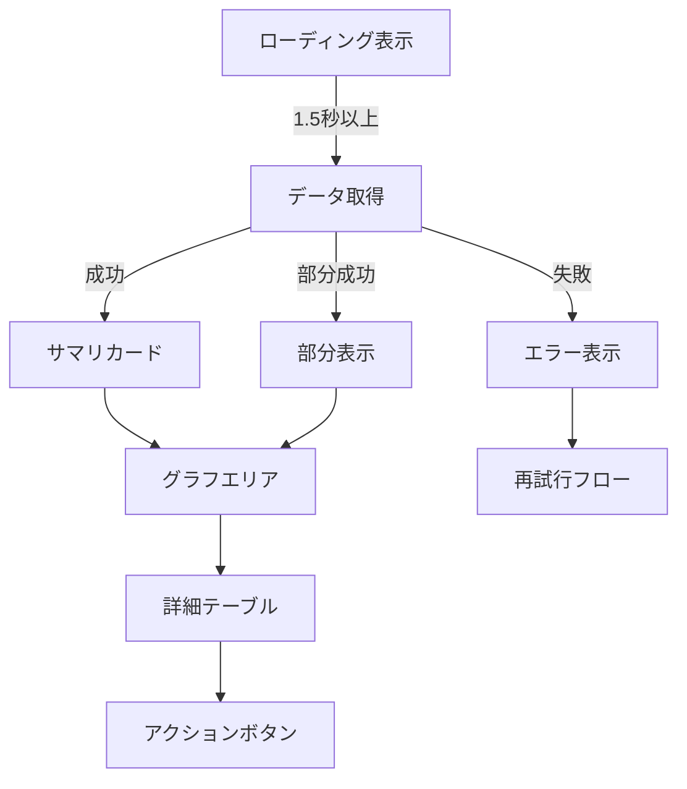

# 📊 GenerateReport.html 仕様書

## 🌟 概要
OneDrive管理の総合レポートを表示するダッシュボード画面

## 🛠️ 主な機能
- ストレージ使用状況の円グラフ表示
- エラー分布の棒グラフ表示
- ユーザー別クォータ状況一覧
- 直近アラート表示
- PDF/印刷出力機能
- データ取得進捗表示
- 部分エラー時のグレースフルデグラデーション

## 🎨 UI構成

## 💻 使用技術
- Chart.js (グラフ表示)
- Bootstrap 5 (レイアウト)
- Font Awesome (アイコン)
- SVG (代替グラフ)

## 🔐 認証要件
- この画面はGenerateReport.ps1で生成され、以下の2つのモードがあります:

1. **CSVから生成する場合**:
   - 認証不要
   - 既存のCSVデータを使用

2. **Graph APIから直接取得する場合**:
   - Azure ADアプリ登録が必要:
     - テナント管理者によるアプリ登録
     - 必要なAPI権限の付与
     - 管理者の同意が必要
   - config.json設定:
     - TenantId: Azure ADテナントID
     - ClientId: 登録アプリのクライアントID
     - ClientSecret: クライアントシークレット
     - 非対話型認証(client_credentials grant)を使用
   - 必要なGraph API権限:
     - User.Read.All
     - Files.Read.All

## 🚨 注意点
- グラフ表示にはChart.jsが必要
- レスポンシブ対応済み
- カラーテーマはBootstrap標準使用
- データ取得中は部分ローディング表示
- グラフ描画中は進捗表示
- 部分エラー時は利用可能なデータのみ表示

## 🎯 特徴
- 危険度に応じた色分け(赤/黄/緑)
- インタラクティブなグラフ表示
- リアルタイムデータ更新可能な構成
