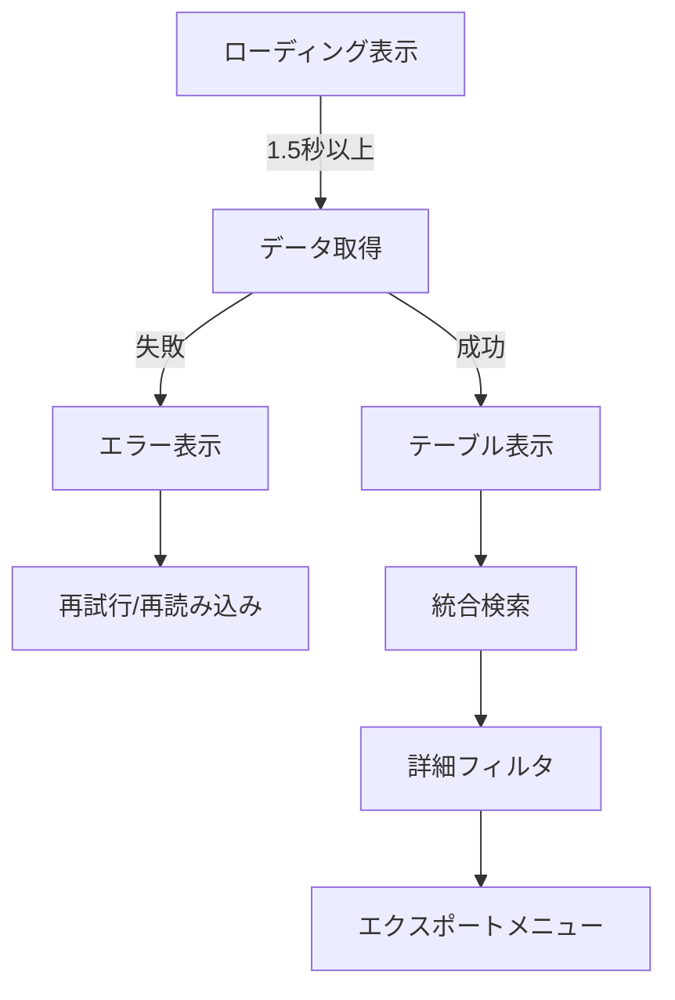

# 📋 GetAllBasicData.html 仕様書

## 🌟 概要
OneDrive基本データを一覧表示する管理画面

## 🛠️ 主な機能
- ユーザー/ストレージ/共有の統合表示
- マルチカラムフィルタリング
- 一括エクスポート機能
- カスタムビュー作成
- ローディングオーバーレイ表示（最低1.5秒保証）
- エラー表示と自動リトライ機能

## 🎨 UI構成

## 💻 使用技術
- Bootstrap 5 (テーブル/モーダル)
- Font Awesome (アイコン)
- カスタムCSS (統合ビュー用スタイル)

## 🔐 認証要件
- この画面はGetAllBasicData.ps1で生成され、以下の2つのモードがあります:

1. **CSVから生成する場合**:
   - 認証不要
   - 既存のCSVデータを使用

2. **Graph APIから直接取得する場合**:
   - Azure ADアプリ登録が必要:
     - テナント管理者によるアプリ登録
     - 必要なAPI権限の付与
     - 管理者の同意が必要
   - config.json設定:
     - TenantId: Azure ADテナントID
     - ClientId: 登録アプリのクライアントID
     - ClientSecret: クライアントシークレット
     - 非対話型認証(client_credentials grant)を使用
   - 必要なGraph API権限:
     - User.Read.All
     - Files.Read.All
     - Sites.Read.All

## 🚨 注意点
- 大量データ処理のためパフォーマンス最適化が必要
- 複数データソースの整合性確認が重要
- 権限管理を厳格に実施
- ローディング表示は最低1.5秒間維持される
- エラー時はユーザーに明確なフィードバックを提供
- ネットワーク遅延に備えたタイムアウト処理を実装

## 🎯 特徴
- 3種類のデータを1画面で統合表示
- カスタマイズ可能なビュープリセット
- ダッシュボード連携機能
