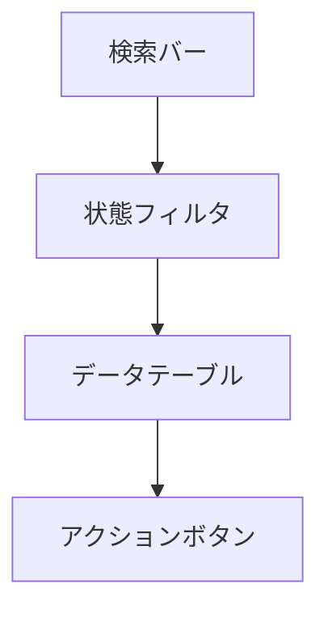

# 💾 GetOneDriveQuota.html 仕様書

## 🌟 概要
OneDriveストレージ使用状況を表示する管理画面

## 🛠️ 主な機能
- ユーザー別ストレージ使用量表示
- 使用率に応じた色分け表示
- 進捗バーによる可視化
- CSVエクスポート機能
- 詳細フィルタリング機能

## 🎨 UI構成

## 💻 使用技術
- Bootstrap 5 (テーブル/進捗バー)
- Font Awesome (アイコン)
- カスタムCSS (危険度別色分け)

## 🔐 認証要件
- この画面はGetOneDriveQuota.ps1で生成され、以下の2つのモードがあります:

1. **CSVから生成する場合**:
   - 認証不要
   - 既存のCSVデータを使用

2. **Graph APIから直接取得する場合**:
   - Azure ADアプリ登録が必要:
     - テナント管理者によるアプリ登録
     - 必要なAPI権限の付与
     - 管理者の同意が必要
   - config.json設定:
     - TenantId: Azure ADテナントID
     - ClientId: 登録アプリのクライアントID
     - ClientSecret: クライアントシークレット
     - 非対話型認証(client_credentials grant)を使用
   - 必要なGraph API権限:
     - Files.Read.All
     - Sites.Read.All

## 🚨 注意点
- 90%以上の使用率は「危険」として赤色表示
- 印刷時も色分けが維持されるよう設定必要

## 🎯 特徴
- 使用率に応じた3段階色分け(緑/黄/赤)
- レスポンシブ対応済み
- リアルタイムデータ更新可能な構成
