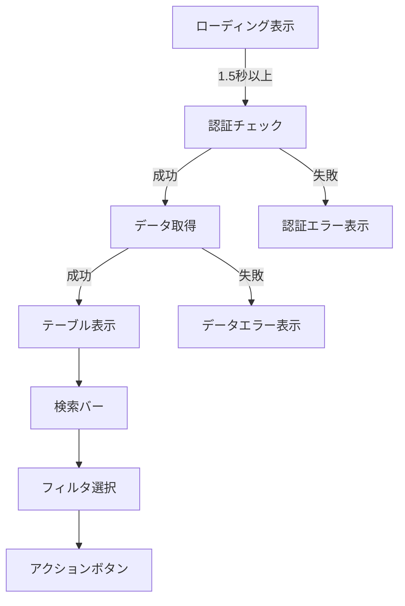

# 👥 GetUserInfo.html 仕様書

## 🌟 概要
ユーザーアカウント情報を表示する管理画面

## 🛠️ 主な機能
- ユーザー一覧表示
- アカウント状態別フィルタリング
- CSVエクスポート機能
- 詳細検索機能
- 標準ローディングオーバーレイ表示
- 認証エラー時のリトライ機能

## 🎨 UI構成

## 💻 使用技術
- Bootstrap 5 (テーブル/レイアウト)
- Font Awesome (アイコン)
- カスタムCSS (状態別色分け)

## 🔐 認証要件
- この画面はGetUserInfo.ps1で生成され、以下の2つのモードがあります:

1. **CSVから生成する場合**:
   - 認証不要
   - 既存のCSVデータを使用

2. **Graph APIから直接取得する場合**:
   - Azure ADアプリ登録が必要:
     - テナント管理者によるアプリ登録
     - 必要なAPI権限の付与
     - 管理者の同意が必要
   - config.json設定:
     - TenantId: Azure ADテナントID
     - ClientId: 登録アプリのクライアントID
     - ClientSecret: クライアントシークレット
     - 非対話型認証(client_credentials grant)を使用
   - 必要なGraph API権限:
     - User.Read.All
     - Directory.Read.All

## 🚨 注意点
- 大量データ対応が必要な場合はページネーション要検討
- 認証エラー時は明確なメッセージ表示が必要
- ローディング表示は最低1.5秒間維持
- 権限エラーとデータエラーを区別して表示
- 機密情報はマスク表示

## 🎯 特徴
- アカウント状態に応じた色分け(有効:緑/無効:黄/停止:赤)
- カラムごとのフィルタ機能
- レスポンシブ対応済み
