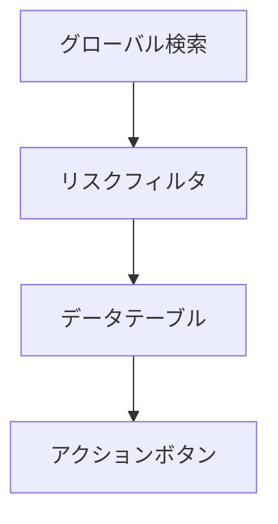

# 🔗 SharingCheck.html 仕様書

## 🌟 概要
OneDrive共有設定を監査する管理画面

## 🛠️ 主な機能
- 外部共有一覧表示
- リスクレベル別分類
- 詳細フィルタリング
- CSVエクスポート機能
- 印刷対応

## 🎨 UI構成

## 💻 使用技術
- Bootstrap 5 (テーブル/レイアウト)
- Font Awesome (アイコン)
- カスタムCSS (リスク別色分け)

## 🔐 認証要件
- この画面はSharingCheck.ps1で生成され、以下の2つのモードがあります:

1. **CSVから生成する場合**:
   - 認証不要
   - 既存のCSVデータを使用

2. **Graph APIから直接取得する場合**:
   - Azure ADアプリ登録が必要:
     - テナント管理者によるアプリ登録
     - 必要なAPI権限の付与
     - 管理者の同意が必要
   - config.json設定:
     - TenantId: Azure ADテナントID
     - ClientId: 登録アプリのクライアントID
     - ClientSecret: クライアントシークレット
     - 非対話型認証(client_credentials grant)を使用
   - 必要なGraph API権限:
     - Files.Read.All
     - Sites.Read.All
     - User.Read.All

## 🚨 注意点
- 高リスク共有は即時対応が必要
- 外部ドメイン共有は特に注意深く監査
- データ更新頻度を明確にすること

## 🎯 特徴
- リスクレベル3段階表示(高:赤/中:黄/低:緑)
- カラムごとの詳細フィルタ機能
- レスポンシブデザイン対応
