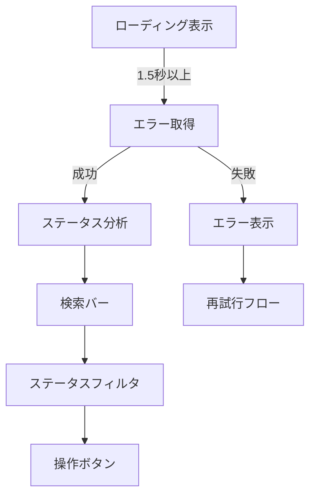

# ⚠️ SyncErrorCheck.html 仕様書

## 🌟 概要
OneDrive同期エラーを管理する画面

## 🛠️ 主な機能
- 同期エラー一覧表示
- ステータス別フィルタリング
- 詳細検索機能
- データ更新機能
- CSVエクスポート
- 標準ローディングオーバーレイ表示
- エラー取得失敗時の自動リトライ

## 🎨 UI構成

## 💻 使用技術
- Bootstrap 5 (テーブル/レイアウト)
- Font Awesome (アイコン)
- カスタムCSS (ステータス別色分け)

## 🔐 認証要件
- この画面はSyncErrorCheck.ps1で生成され、以下の2つのモードがあります:

1. **CSVから生成する場合**:
   - 認証不要
   - 既存のCSVデータを使用

2. **Graph APIから直接取得する場合**:
   - Azure ADアプリ登録が必要:
     - テナント管理者によるアプリ登録
     - 必要なAPI権限の付与
     - 管理者の同意が必要
   - config.json設定:
     - TenantId: Azure ADテナントID
     - ClientId: 登録アプリのクライアントID
     - ClientSecret: クライアントシークレット
     - 非対話型認証(client_credentials grant)を使用
   - 必要なGraph API権限:
     - Files.Read.All
     - Sites.Read.All
     - User.Read.All

## 🚨 注意点
- 未対応の重大エラーは赤色で強調表示
- データ更新時はユーザーに通知
- 機密情報が含まれる可能性あり
- ローディング表示中はエラー詳細をマスク
- エラー取得失敗時はステータスを不明表示
- 大量データ取得時のパフォーマンス最適化

## 🎯 特徴
- ステータス別4色表示(未対応:赤/調査中:黄/対応中:青/解決済:緑)
- リアルタイム更新ボタン
- 印刷用レイアウト最適化

## 📅 更新情報
- **最終更新日**: 2025年4月28日
- **現在の動作状況**:
  - WebUIサーバー: ポート8005で稼働中 (http://localhost:8005/SyncErrorCheck.html)
  - テストデータ: シミュレーションデータを使用中
